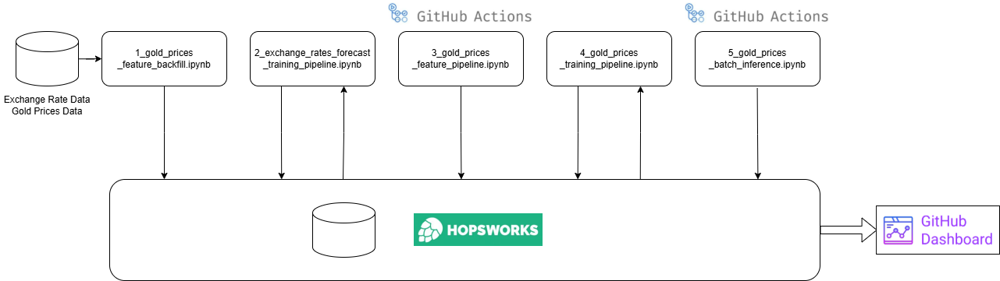

# ID2223Project

## Description

This repository is a course final project for ID2223 Scalable Machine Learning and Deep Learning in KTH. And here is the motivation of this project:

Managing financial assets effectively is a critical concern for modern individuals and organizations. Therefore, we implement this project to predict daily gold prices and try to analyze the relationship between USD exchange rate fluctuations and gold price movements. By using everyday exchange rates and gold prices, this project aims to provide actionable insights for informed decision-making. Using multi-output regression and  time-series prediction models, we will evaluate the impact of currency value changes on gold prices. The results will be presented through the dashboard hosted on GitHub Page, enabling users to explore predictions and analyze trends with ease.

To meet the requirement of the course project, we need to:

- Manage dynamic data sources
- Train models and make predictions
- Deploy pipelines to build the system

## Technologies & APIs

**yfinance**: Fetch Yahoo Finance data to generate data sets.

**Frankfurter**: Fetch exchange rate data to generate data sets.

**XGBoost**: Train and predict for multi-output regression and time series forecasting tasks.

**Hopsworks**: Manage and store features and model registry.

**GitHub Page**: Deploy dashboard online.

## Structure & Our Work Flow

First, we use `yfinance` and `Frankfurter` to implement a tool for fetching Yahoo Finance gold prices history data and exchange rate data. We create DataFrames from those data and create feature groups on Hopsworks through [1_gold_prices_feature_backfill.ipynb](1_gold_prices_feature_backfill.ipynb).

Secondly, we retrieved historical exchange rate from Hopsworks and trained a multi-output regression model using `XGBoost`. By integrating exchange rate data from previous days, the model predicts the exchange rate changes for multiple currency pairs for the following day. This approach was used to make predictions for 5 consecutive days, and the model was uploaded to the Hopsworks file system through the [2_exchange_rates_forecast_training_pipeline.ipynb](2_exchange_rates_forecast_training_pipeline.ipynb). Here is a chart illustrates the exchange rate changes of one of the currencies predicted by our model, demonstrating relatively accurate predictions.

Then we deploy [3_gold_prices_feature_pipeline.ipynb](3_gold_prices_feature_pipeline.ipynb) on `GitHub Actions` to update the latest data to Hopsworks every business day. Here, we use the previously trained model to predict exchange rates for the next 5 days consecutively based on the exchange rates from the previous 10 business days. The predicted values, along with the actual values of the current day, are then backfilled into the corresponding feature groups in Hopsworks.

After that, we retrieved historical feature groups from Hopsworks and trained the final model to predict gold prices for the next 5 days using `XGBoost`. The model was uploaded to the Hopsworks file system through the [4_gold_prices_training_pipeline.ipynb](4_gold_prices_training_pipeline.ipynb). Here is a chart illustrates the gold price changes predicted by our model, demonstrating relatively accurate predictions.

Finally, we deploy [5_gold_prices_batch_inference.ipynb](5_gold_prices_batch_inference.ipynb) on `GitHub Actions` to prdict the gold prices on business days and update GitHub Pages online dashboard for visualizing the prediction results.

## How to Run

1. Clone this repo.
2. Configure the Canda virtual environment and install [requirements](requirements.txt).
3. Create accounts on [hopsworks.ai](https://www.hopsworks.ai/), create/cofigure necessary API keys and tokens.
4. Run all [1_gold_prices_feature_backfill.ipynb](1_gold_prices_feature_backfill.ipynb), [2_exchange_rates_forecast_training_pipeline.ipynb](2_exchange_rates_forecast_training_pipeline.ipynb), [3_gold_prices_feature_pipeline.ipynb](3_gold_prices_feature_pipeline.ipynb), [4_gold_prices_training_pipeline.ipynb](4_gold_prices_training_pipeline.ipynb) and [5_gold_prices_batch_inference.ipynb](5_gold_prices_batch_inference.ipynb) in order.
5. Push the repo to your GitHub and it will automatically update this project's GitHub Pages every business day.

## Gradio app

[GitHub Page](https://amomozzz.github.io/ID2223_project/)

## Contributors

The contributors of this repo are Long Ma and Yining Hou.

## License

This project is licensed under the Apache License 2.0. See the [LICENSE](LICENSE) file for details.
